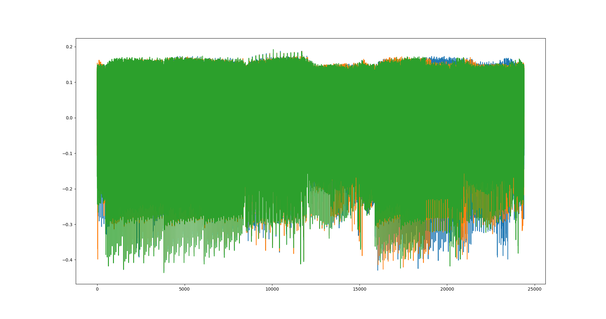

# rhme-2016 write-up Still not scary...

<a name="stillnotscary"></a>
## Still not scary... (Side Channel Analysis - 300 pts)

We acquired 200 traces from the same setup. We noticed a desynchronization.

We used this synchronization function :

``` python
def min_dist_curve(curve,ref,shifting_window,pattern_window):                   
      distmin = sys.maxint                                                      
      for s in range(shifting_window[0],shifting_window[1]):                    
          dist = 0                                                              
          for p in range(pattern_window[0],pattern_window[1]):                  
              dist = dist + np.abs(ref[p] - curve[p+s])                         
          distmin = min(dist,distmin)                                           
          if distmin == dist:                                                   
              offset = s                                                        
      return offset,distmin  
```

After alignement we decided to change selection funtion from AES Sbox to AES 
AddRoundKey as we thought that masking has been implemented. We noticed that no 
jitter has been put around AddRoundKey function ... PERFECT.

Here is an overview after synchronization


Before 6500 we can see some fake AddRoundKey.
The last set of AddRoundKey are locate betwee 6500 and 8500.
After 8500 we can see the Sbox routines.

The script performing the attack looks like:

``` python
# Traces offset where ARK has been identified
tbegin = 6500                                                                   
tend =  8500                                                                    
                                                                                
byte = 0                                                                        
found = 0                                                                      
# Buffer containing the retrieved key
key = []                                                                        
# Key space length 
knumber = 256      
# Hypothesis drived by key guess                                               
hyp = np.zeros(shape=(256,len(textin)))                                        

# We fill hypothesis for all messages given a key guess 
for i in range(len(textin)):                                                    
    for kg in range(knumber):                                                   
        hyp[kg][i] = pysca.hw(kg^textin[i][byte])                               

# We go through with traces point per point            
t = tbegin                                                                      
while t < tend:                                                                 
    # Observation array containing all traces at time t
    obs = [] 
    for i in range(len(textin)):                                                
        obs.append(synctracedata[i][t])
    
    # We test all possible key and compute a correlation
    for kg in range(knumber):                    

	# Correlation coefficient is included in [-1;1]
	# Our setup have a reversed the power comsumption maybe to due a switch
	# Nevermind the correlation is negative, an absolute value can be taken
	# but it will bring couple of fake correlation

        if (np.corrcoef(hyp[kg],obs)[0][1] < -0.7):                             
            if not found:                                                       
                print byte, t, hex(kg)                                          
                key.append(kg)                                                  
                found = 1                                                       
                break                                                           
        if found and (np.abs(np.corrcoef(hyp[kg],obs)[0][1]) < 0.7):            
            found = 0                                                           
            byte = byte + 1                                                    
    t = t + 1                                                                   

``` 

The attack retrieved all key bytes with some ambiguity. We had a plaintext and 
a ciphertext. So we bruteforced key bytes which were ambiguous. 
The good key has been then recovered.
